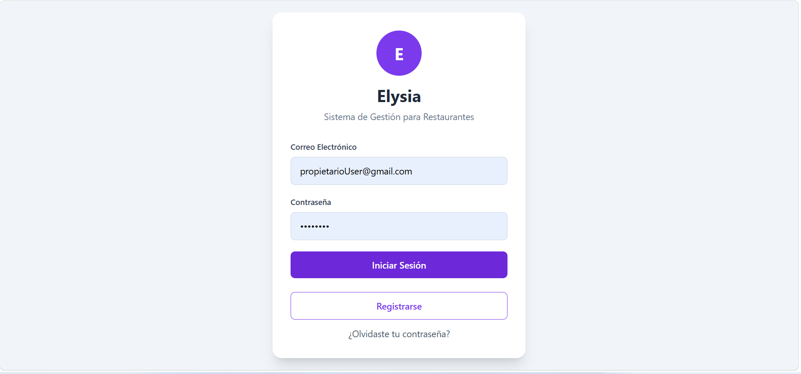
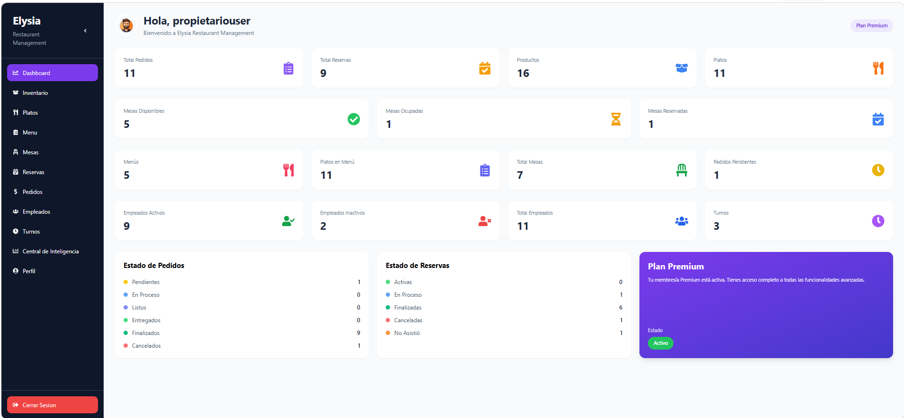

# Elysia

<p align="center">
  
</p>

<p align="center">
  <strong>Restaurant Management Platform</strong>
</p>

<p align="center">
  Plataforma integral para la administración y gestión de restaurantes.
</p>

---

## Tabla de Contenido

* [Descripción General](#descripción-general)
* [Características Principales](#características-principales)
* [Módulos del Sistema](#módulos-del-sistema)
* [Roles y Acceso](#roles-y-acceso)
* [Arquitectura](#arquitectura)
* [Tecnologías](#tecnologías)
* [Seguridad](#seguridad)
* [Modelo de Datos](#modelo-de-datos)
* [API REST](#api-rest)
* [Instalación y Ejecución](#instalación-y-ejecución)
* [Configuración](#configuración)
* [Capturas de Pantalla](#capturas-de-pantalla)
* [Autores](#autores)

---

# Descripción General

**Elysia** es una plataforma de gestión para restaurantes diseñada para centralizar y digitalizar las principales operaciones administrativas y operativas de un establecimiento gastronómico.

La plataforma permite administrar desde la información general del restaurante, inventario y catálogo de platos, hasta mesas, reservas, pedidos, empleados y turnos.

Además, Elysia incorpora un **sistema de administración centralizado** que permite gestionar propietarios, administradores, membresías, tarjetas y otros elementos relacionados con la operación de la plataforma.

El sistema está desarrollado bajo una arquitectura orientada a la separación de responsabilidades, buscando facilitar el mantenimiento, escalabilidad y evolución de la aplicación.

---

# Características Principales

* Gestión integral de restaurantes.
* Dashboard con indicadores y métricas operativas.
* Administración de inventario.
* Gestión de platos y categorías.
* Creación y administración de menús.
* Administración y disponibilidad de mesas.
* Gestión de reservas.
* Gestión y seguimiento de pedidos.
* Administración de empleados.
* Gestión de turnos.
* Central de Inteligencia.
* Sistema de membresías.
* Administración de propietarios.
* Administración de usuarios y administradores.
* Autenticación y autorización basada en roles.
* API RESTful.
* Persistencia mediante Entity Framework Core.
* Base de datos SQL Server.
* Interfaz web moderna y responsive.

---

# Módulos del Sistema

Elysia se divide principalmente en dos áreas de operación:

## Panel del Propietario

El propietario de un restaurante dispone de un panel centralizado desde el cual puede administrar las operaciones de su establecimiento.

### Dashboard

El dashboard proporciona una visión general del estado del restaurante mediante indicadores y métricas.

Entre los indicadores disponibles se encuentran:

* Total de pedidos.
* Total de reservas.
* Productos registrados.
* Platos disponibles.
* Mesas disponibles.
* Mesas ocupadas.
* Mesas reservadas.
* Menús registrados.
* Platos asociados a menús.
* Total de mesas.
* Pedidos pendientes.
* Empleados activos e inactivos.
* Total de empleados.
* Turnos registrados.
* Estado de pedidos.
* Estado de reservas.
* Estado de la membresía.

<p align="center">
  
</p>

---

## Inventario

Permite administrar los productos utilizados por el restaurante.

Incluye funcionalidades para:

* Registrar productos.
* Actualizar productos.
* Consultar inventario.
* Controlar cantidades disponibles.
* Administrar información de productos.
* Gestionar el estado de los productos.

---

## Platos

Permite administrar los platos ofrecidos por el restaurante.

Entre sus funcionalidades se encuentran:

* Registro de platos.
* Actualización de información.
* Administración de precios.
* Asociación con menús.
* Gestión del estado de los platos.

---

## Menús

Permite crear y administrar diferentes menús del restaurante.

Los menús pueden organizar y agrupar los platos disponibles para facilitar su administración y presentación.

---

## Mesas

El módulo de mesas permite administrar la distribución y disponibilidad de las mesas del restaurante.

El sistema permite identificar diferentes estados, incluyendo:

* Disponibles.
* Ocupadas.
* Reservadas.

---

## Reservas

Permite administrar las reservas realizadas para el restaurante.

El sistema proporciona seguimiento de diferentes estados de las reservas, incluyendo:

* Activas.
* En proceso.
* Finalizadas.
* Canceladas.
* No asistencia.

---

## Pedidos

Permite gestionar el flujo de pedidos dentro del restaurante.

Los pedidos pueden ser monitoreados mediante diferentes estados:

* Pendientes.
* En proceso.
* Listos.
* Entregados.
* Finalizados.
* Cancelados.

---

## Empleados

Permite administrar el personal asociado al restaurante.

Incluye:

* Registro de empleados.
* Actualización de información.
* Activación e inactivación.
* Consulta de empleados.
* Control del personal asociado al restaurante.

---

## Turnos

Permite administrar los turnos de trabajo del personal y organizar la operación del restaurante de acuerdo con sus horarios.

---

## Central de Inteligencia

Elysia incorpora una sección orientada al análisis y asistencia inteligente dentro de la plataforma.

Este módulo busca proporcionar información y herramientas que ayuden al propietario a interpretar la información generada por el restaurante y apoyar la toma de decisiones.

---

# Panel de Administración

Además del panel utilizado por los propietarios, Elysia cuenta con un área administrativa para la gestión central de la plataforma.

Desde este panel se pueden administrar elementos como:

* Propietarios de restaurantes.
* Administradores.
* Membresías.
* Tarjetas asociadas a las membresías.
* Usuarios.
* Estados de las cuentas.
* Información general de la plataforma.

Esta separación permite diferenciar las responsabilidades entre la administración de **Elysia como plataforma** y la administración de **cada restaurante**.

---

# Roles y Acceso

Elysia implementa un sistema de autorización basado en roles.

Los permisos determinan las operaciones que cada usuario puede realizar dentro de la plataforma.

### Principales perfiles

| Rol           | Descripción                                                            |
| ------------- | ---------------------------------------------------------------------- |
| Administrador | Gestiona los recursos generales de la plataforma.                      |
| Propietario   | Administra la información y operaciones de su restaurante.             |
| Empleado      | Accede a las funcionalidades correspondientes a sus responsabilidades. |

La autorización se aplica tanto a nivel de aplicación como en los endpoints protegidos de la API.

---

# Arquitectura

Elysia utiliza una arquitectura basada en **Onion Architecture**, buscando mantener una clara separación entre las reglas de negocio, la lógica de aplicación, la infraestructura y la presentación.

### Vista general

```text
┌──────────────────────────────────────────────┐
│              Frontend - React                │
│              TypeScript / UI                 │
├──────────────────────────────────────────────┤
│                                              │
│  Panel Administración    Panel Propietario  │
│                                              │
└──────────────────────┬───────────────────────┘
                       │
                       │ HTTP / REST
                       ▼
┌──────────────────────────────────────────────┐
│          Presentation - ASP.NET Core         │
│                  REST API                    │
└──────────────────────┬───────────────────────┘
                       │
                       ▼
┌──────────────────────────────────────────────┐
│                Application                   │
│       Services / DTOs / Validations          │
└──────────────────────┬───────────────────────┘
                       │
                       ▼
┌──────────────────────────────────────────────┐
│                   Domain                     │
│       Entities / Interfaces / Rules          │
└──────────────────────▲───────────────────────┘
                       │
                       │
┌──────────────────────┴───────────────────────┐
│               Infrastructure                  │
│      EF Core / Identity / Repositories       │
└──────────────────────┬───────────────────────┘
                       │
                       ▼
                 ┌─────────────┐
                 │ SQL Server  │
                 └─────────────┘
```

### Principios aplicados

* Separación de responsabilidades.
* Bajo acoplamiento.
* Alta cohesión.
* Inversión de dependencias.
* Independencia de infraestructura.
* Código mantenible y escalable.
* Centralización de reglas de negocio.

---

# Tecnologías

| Tecnología                | Uso                                    |
| ------------------------- | -------------------------------------- |
| **C#**                    | Lenguaje principal del backend         |
| **ASP.NET Core**          | Desarrollo de la API y backend         |
| **Entity Framework Core** | ORM y acceso a datos                   |
| **SQL Server**            | Base de datos                          |
| **ASP.NET Identity**      | Gestión de usuarios y autenticación    |
| **JWT**                   | Autenticación y autorización de la API |
| **React**                 | Desarrollo del frontend                |
| **TypeScript**            | Tipado y desarrollo del frontend       |
| **Tailwind CSS**          | Diseño e interfaz                      |
| **REST API**              | Comunicación entre frontend y backend  |
| **Git / GitHub**          | Control de versiones y colaboración    |

---

# Seguridad

La seguridad constituye una parte fundamental de Elysia.

La plataforma implementa diferentes mecanismos para proteger el acceso a los recursos y operaciones del sistema.

### Autenticación

Se utiliza **ASP.NET Core Identity** para la gestión de usuarios y credenciales.

La comunicación con los endpoints protegidos utiliza autenticación basada en **JWT (JSON Web Tokens)**.

### Autorización

Los endpoints y funcionalidades se encuentran protegidos mediante autorización basada en roles y permisos.

Esto permite restringir el acceso a funcionalidades administrativas y operativas según el perfil del usuario.

### Principales mecanismos

* ASP.NET Core Identity.
* JWT Bearer Authentication.
* Autorización basada en roles.
* Validación de solicitudes.
* Protección de endpoints.
* Separación de responsabilidades.
* Gestión segura de credenciales y configuraciones sensibles.

---

# Modelo de Datos

La base de datos de Elysia se encuentra implementada sobre **SQL Server** y utiliza **Entity Framework Core** como mecanismo de persistencia.

Entre las principales entidades del sistema se encuentran:

```text
Usuario
   │
   ├── Propietario
   │       │
   │       └── Restaurante
   │               │
   │               ├── Inventario
   │               ├── Platos
   │               ├── Menús
   │               ├── Mesas
   │               ├── Reservas
   │               ├── Pedidos
   │               ├── Empleados
   │               └── Turnos
   │
   └── Roles / Autorización

Plataforma
   │
   ├── Administradores
   ├── Propietarios
   ├── Membresías
   └── Tarjetas
```

La estructura permite mantener separada la información de los diferentes restaurantes y sus operaciones.

---

# API REST

El backend de Elysia expone servicios RESTful mediante ASP.NET Core.

La API actúa como capa de comunicación entre el frontend y los servicios internos de la aplicación.

Entre las áreas gestionadas por la API se encuentran:

* Autenticación.
* Usuarios.
* Propietarios.
* Restaurantes.
* Inventario.
* Platos.
* Menús.
* Mesas.
* Reservas.
* Pedidos.
* Empleados.
* Turnos.
* Membresías.
* Administración.

Los endpoints protegidos requieren las credenciales y permisos correspondientes.

---

# Instalación y Ejecución

## Requisitos

Antes de ejecutar el proyecto se recomienda contar con:

* .NET SDK
* Node.js
* NPM
* SQL Server
* Visual Studio o Visual Studio Code
* Git

---

## Backend

Clonar el repositorio:

```bash
git clone https://github.com/HectorMMartinez/Elysia.git
```

Acceder al proyecto:

```bash
cd Elysia
cd "Elysia backend"
```

Restaurar dependencias:

```bash
dotnet restore
```

Aplicar las migraciones de Entity Framework Core:

```bash
dotnet ef database update
```

Ejecutar la API:

```bash
dotnet run
```

---

## Frontend

Desde la carpeta del frontend:

```bash
cd Front-end-Elysia
```

Instalar las dependencias:

```bash
npm install
```

Ejecutar el proyecto:

```bash
npm run dev
```

La URL exacta del frontend dependerá de la configuración del entorno de desarrollo.

---

# Configuración

Las configuraciones específicas del entorno deben mantenerse fuera del código fuente cuando contengan información sensible.

Entre los valores que pueden requerir configuración se encuentran:

* Cadena de conexión de SQL Server.
* Claves JWT.
* Credenciales de servicios externos.
* Configuración de servicios de inteligencia artificial.
* URLs de servicios.
* Variables específicas del entorno.

Para desarrollo local se recomienda utilizar mecanismos como **.NET User Secrets** o variables de entorno para evitar almacenar credenciales sensibles en el repositorio.

---

# Capturas de Pantalla

## Inicio de Sesión

La plataforma cuenta con una interfaz de autenticación desde la cual los usuarios pueden acceder al sistema según sus credenciales y permisos.

<p align="center">
  
</p>

## Dashboard del Propietario

El dashboard presenta una visión general del estado operativo del restaurante y sus principales indicadores.

<p align="center">
  
</p>

---

# Estructura del Repositorio

```text
Elysia/
│
├── Elysia backend/
│   ├── Elysia.Domain/
│   ├── Elysia.Application/
│   ├── Elysia.Infrastructure/
│   └── Elysia.Presentation.WebApi/
│
├── Front-end-Elysia/
│
├── docss/
│   ├── b71ba7be-5f55-4be8-8f0a-ff1581f84e93.png
│   └── propietario-dashboard.png
│
├── .gitignore
├── LICENSE
└── README.md
```

---

# Objetivo del Proyecto

Elysia busca proporcionar una solución tecnológica que permita a los restaurantes centralizar sus operaciones en una única plataforma, reduciendo la dependencia de procesos manuales y facilitando el acceso a información relevante para la gestión del negocio.

La plataforma combina herramientas administrativas, operativas y de análisis dentro de un mismo ecosistema.

---

# Autores

Proyecto desarrollado como parte del proceso de formación académica en el **Instituto Tecnológico de Las Américas (ITLA)**.

### Equipo de Desarrollo


* Hector Martinez
* Kelvin Jose Diaz Ramirez
* Andris Peguero

---

<p align="center">
  <strong>Elysia — Restaurant Management Platform</strong>
</p>

<p align="center">
  Gestión inteligente. Operaciones centralizadas. Restaurantes más eficientes.
</p>
```
